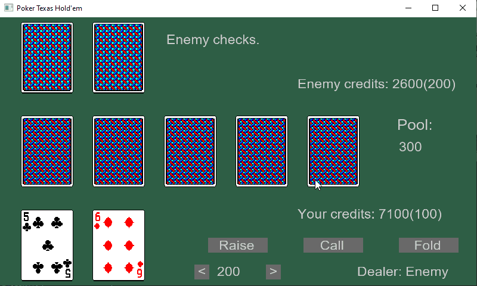
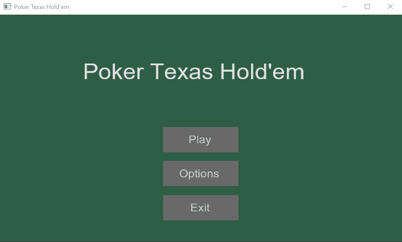

# Poker Texas Hold'em
Singleplayer OpenGL poker game. Enemy AI uses [MCTS](https://en.wikipedia.org/wiki/Monte_Carlo_tree_search) algorithm.

### Play aganist AI opponent
  

### Customization options
  

# Requirements
- Windows
- Visual Studio 17+